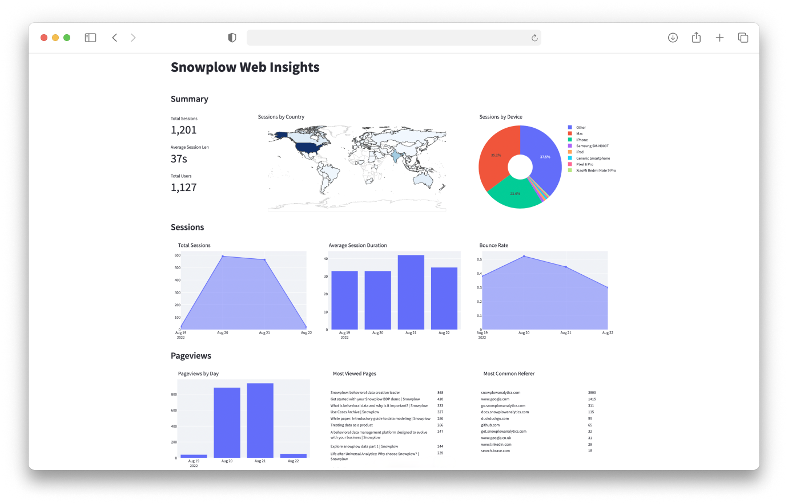
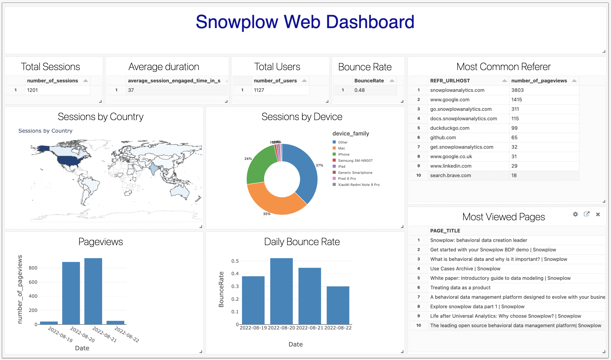

+++
title = "Introduction"
menuTitle = "Introduction"
pre = "<i class='fas fa-rocket'></i> "
chapter = false
weight = 1
+++

Welcome to the **Advanced Analytics for Web** accelerator. Once finished, you will be able to build a deeper understanding of customer behaviour on your website and use your data to influence business decisions.

Here you will learn to:

* Model and Visualise Snowplow data
  - using the [snowplow-web](https://hub.getdbt.com/snowplow/snowplow_web/latest/) dbt package and Streamlit
  - using our sample data for Snowflake or Databricks (no need to have a working pipeline)
* Set-up Snowplow Tracking and Enrichment
* Apply what you have learned on your own pipeline to gain insights
***

#### Who is this guide for?

- Data practitioners who would like to get familiar with Snowplow data.
- Data practitioners who want to learn how to use the snowplow-web dbt package and set-up tracking using their companies website or single page application, to gain insight from their customers’ behavioural data as quickly as possible.

***

#### What you will learn

In approximately 8 working hours you can achieve the following:

- **Upload data -** Upload a sample Snowplow events dataset to your warehouse
- **Model -** Configure and run the snowplow-web data model
- **Visualise -** Visualise the modeled data with Streamlit
- **Track -** Set-up and deploy tracking to your website or single page application
- **Enrich -** Add enrichments to your data
- **Next steps -** Gain value from your own pipeline data through modeling and visualisation


gantt
        dateFormat  HH-mm
        axisFormat %M
        section 1. Upload
        1h          :upload, 00-00, 1m
        section 2. Model
        1h          :model, after upload, 1m
        section 3. Visualise
        1h          :visualise, after model, 1m
        section 4. Track
        2h          :track, after visualise, 2m
        section 5. Enrich
        1h          :enrich, after track, 1m
        section 6. Next steps
        2h          :next steps, after enrich, 2m



***

#### Prerequisites

**Modeling and Visualisation**
- dbt CLI installed or dbt Cloud account available
  - New dbt project created and configured
- Python 3 Installed
- Snowflake or Databricks account and a user with access to create schemas and tables

**Tracking and Enrichment**
- Snowplow pipeline
- Web app to implement tracking

{}
Please note that Snowflake and Databricks will be used for illustration but the snowplow-web dbt package also supports **BigQuery, Postgres** and **Redshift**. Further adapter support for this accelerator coming soon!
{}

***
#### What you will build

**Advanced Analytics for Web Dashboard** - with Streamlit or Databricks



{}

{}

{}


