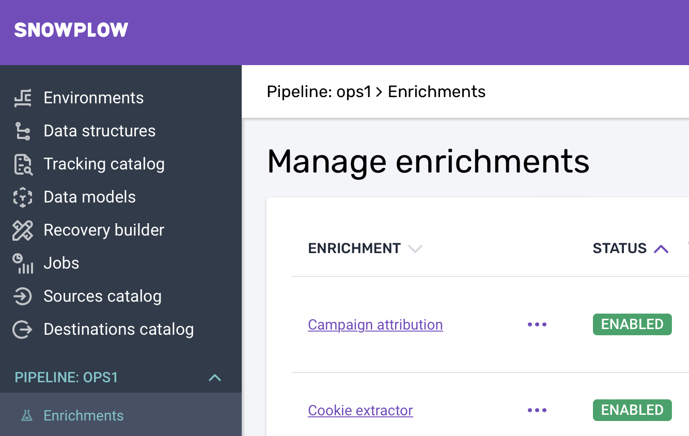

To enrich your data we recommend enabling the below enrichments within your Console:

| Enrichment            | Description |
|---                    |---|
| Campaign attribution  |  The original version of the campaign attribution enrichment lets you choose which querystring parameters will be used to generate the marketing campaign fields mkt_medium, mkt_source, mkt_term, mkt_content, and mkt_campaign. If you do not enable the campaign_attribution enrichment, those fields will not be populated. |
|  Cookie extractor     | This community-contributed enrichment lets you specify cookies that you want to extract if found; each extracted cookie will end up a single derived context in the JSON Schema org.ietf/http_cookie/jsonschema/1-0-0.  |
|  Event fingerprint    |  This enrichment generates a fingerprint for the event using a hash of client-set fields. This is helpful when deduplicating events. |
|  IAB                  | The IAB Spiders & Robots Enrichment uses the IAB/ABC International Spiders and Bots List to determine whether an event was produced by a user or a robot/spider based on its' IP address and user agent. |
|  IP lookups           | This enrichment uses MaxMind databases to look up useful data based on a user's IP address. Please change the 'uri' attribute to point to where your MaxMind database is hosted. See the documentation for more details.  |
|  PII Pseudonymization |  The PII Enrichment provides capabilities for Snowplow operators to better protect the privacy rights of data subjects by psuedoanonymizing collected data. |
|  Referer parser       | The referer parser enrichment uses the Snowplow referer-parser to extract attribution data from referer URLs.  |
|  UA parser             | This enrichment uses the ua-parser library to parse the useragent and attach a ua_parser_context to each event.  |
|  YAUAA                | This enrichment uses YAUAA API to parse and analyze the user agent string of an event and extract as many relevant attributes as possible, like for example the device class (Phone, Tablet, etc.).  |
